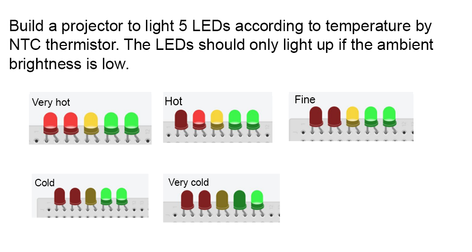
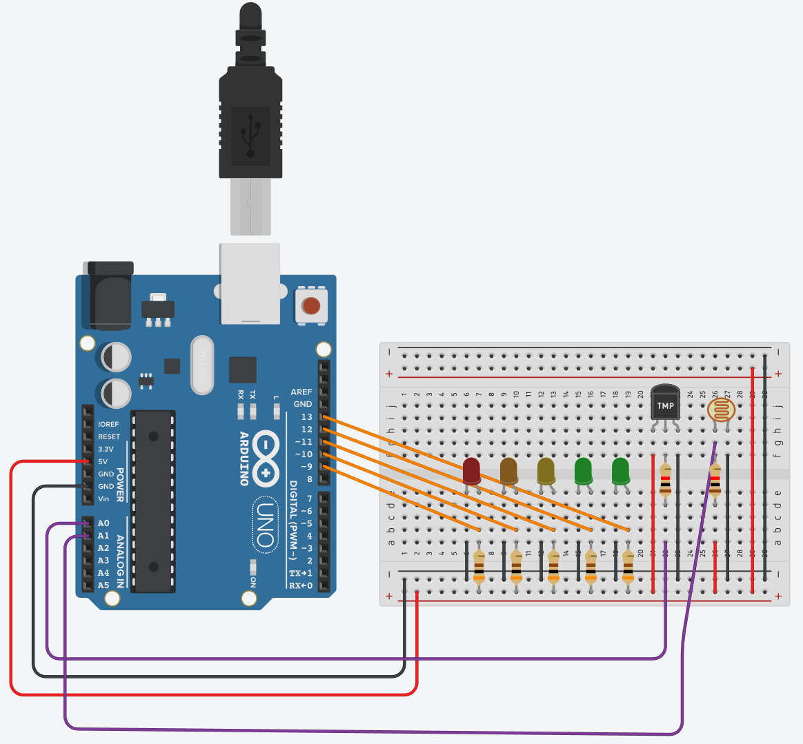

# Low-light-thermistor-based-temperature detection

## ℹ️ Description

Build a project to light up 5 LEDs according to the temperature
measured by the NTC thermistor. The LEDs should only light up if the
ambient light is low. 

  

---
<!---
## 👁️‍🗨️ Preview
&nbsp;
[Video](youtube.com/meuvideo) 

---
-->
## ⚙️ **Materials**

* Arduino
* 2 red LEDs
* 1 yellow LED
* 2 green LEDs
* 1 LDR
* 1 NTC 10k temperature sensor (thermistor)
* Various resistors
---

## ⚙️ **Configuration**

  

---

## 🛠️ **Technologies**

&nbsp;
&nbsp;
