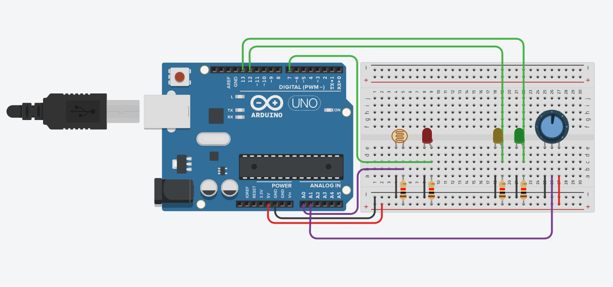
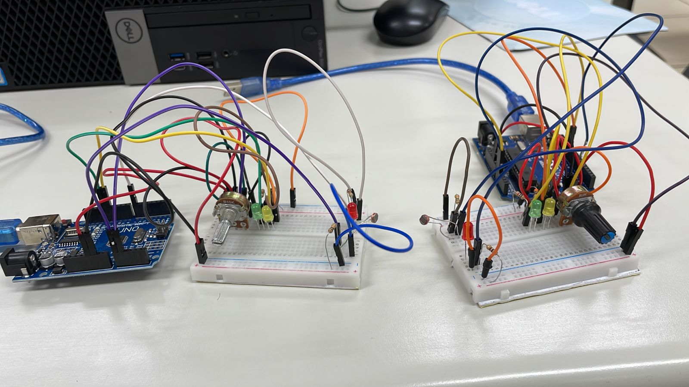

# Morse-Code-Communicator-with-LEDs-and-Light-Receiver

## ℹ️ Description

Make a communication system between two arduinos through the light of LEDs through morse code and light receivers.  
The arduino 1 must send two numbers (0 to 9) through morse code, the arduino 2 must receive these two numbers, perform their sum and return the value by morse code through its led to the arduino 1 LDR. Finally, the arduino 1 must print the summed value on the serial terminal.

⚠️Some parts of the code may be written in Portuguese-BR, please use google translator if you need.

---
<!---
## 👁️‍🗨️ Preview
&nbsp;
[Video](youtube.com/meuvideo) 

---
-->
## 🔌 **Materials**

* 2 Arduino
* 2 Protoboard
* 2 Potentiometer
* 2 LDR
* 6 LEDs
* Various resistors and cables
---

## ⚙️ **Configuration**

  

  

  

---

## 🛠️ **Technologies**

&nbsp;
&nbsp;
