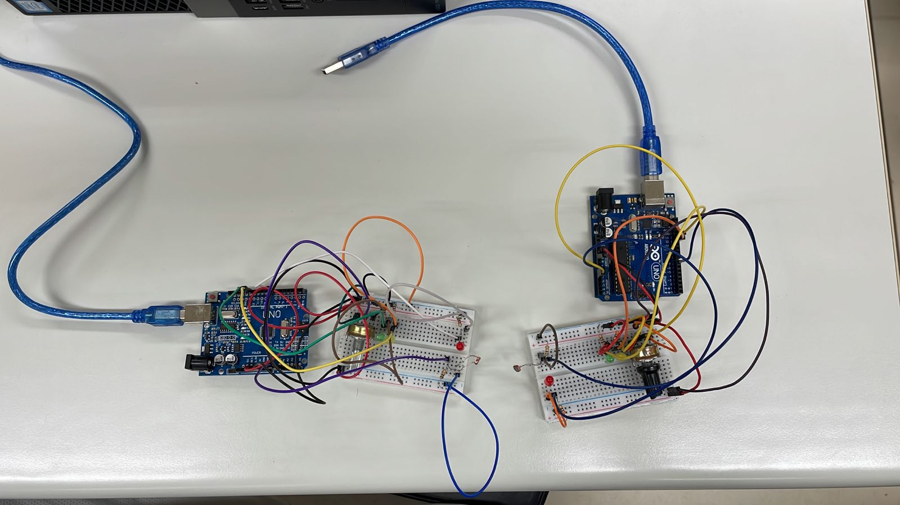

# Low-light-thermistor-based-temperature detection

## ℹ️ Description

  

---
<!---
## 👁️‍🗨️ Preview
&nbsp;
[Video](youtube.com/meuvideo) 

---
-->
## 🔌 **Materials**

* 2 Arduino
* 2 Protoboard
* 2 Potentiometer
* 2 LDR
* 6 LEDs
* Various resistors and cables
---

## ⚙️ **Configuration**

  

  

  

---

## 🛠️ **Technologies**

&nbsp;
&nbsp;
