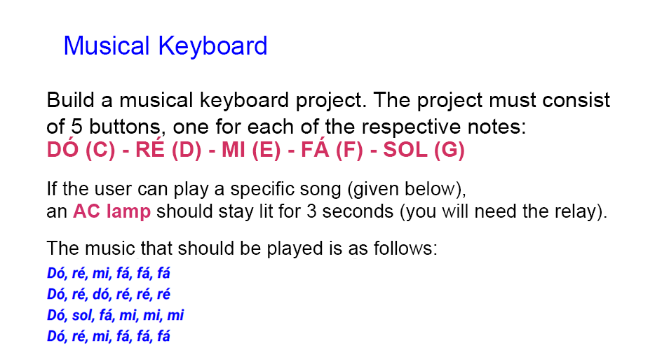

# Musical-keyboard

## ℹ️ Description

  

---
<!---
## 👁️‍🗨️ Preview
&nbsp;
[Video](youtube.com/myvideo) 

---
-->
## 🔌 **Materials**

* Arduino
* Protoboard
* 1 LED (optional)
* 1 AC Lamp 
* 1 Relay
* 1 Function generator
* 5 buttons
* Various resistors and cables
---
## ⚙️ **Configuration**

  

---

## 🛠️ **Technologies**

&nbsp;
&nbsp;
