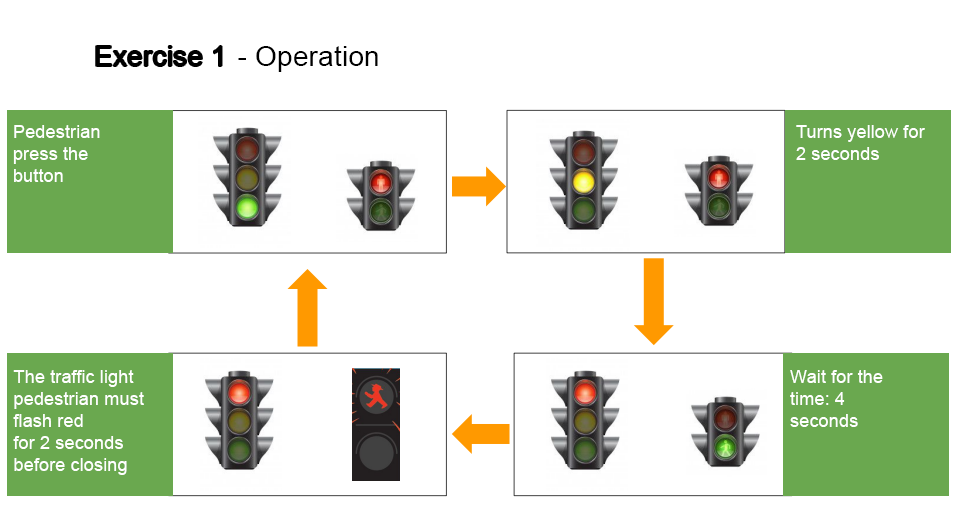
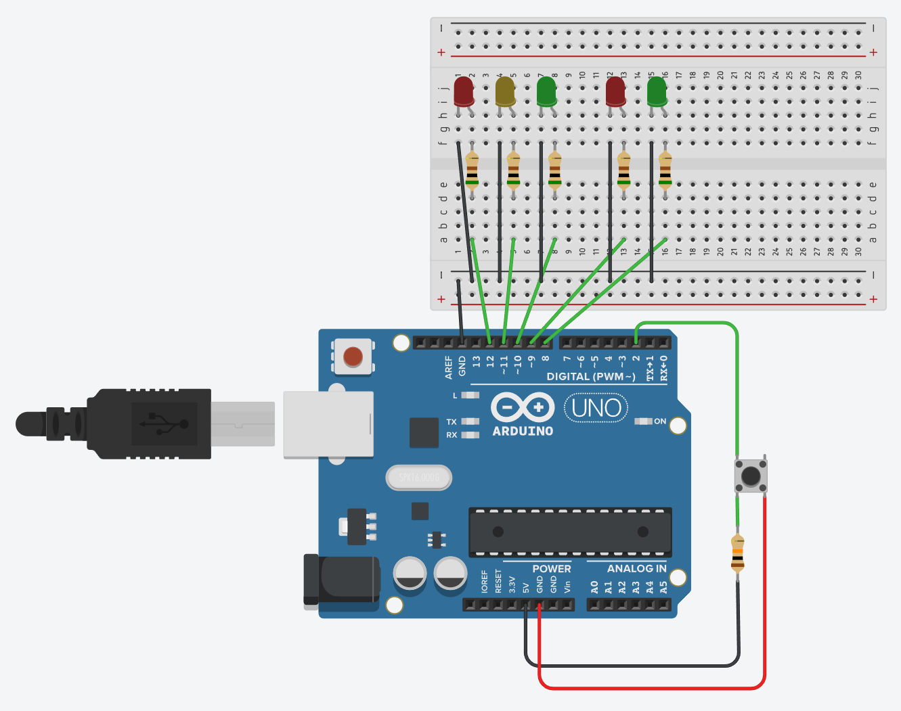

# Traffic-light-system-with-button

## ℹ️ Description

Make a project of a traffic light for cars and pedestrians like what we see on the streets. The set must have a button, 
which will be pressed by the pedestrian when desired pass through. The time to cross should be around 4 seconds. 
Whenever there are 2 seconds left to close, the red traffic light for the pedestrians must flash until fully closed. 

  

---
<!---
## 👁️‍🗨️ Preview
&nbsp;
[Video](youtube.com/myvideo) 

---
-->
## 🔌 **Materials**

* Arduino
* Protoboard
* 2 red LEDs
* 1 yellow LED
* 2 green LEDs
* Various resistors
---
## ⚙️ **Configuration**

  

---

## 🛠️ **Technologies**

&nbsp;
&nbsp;
